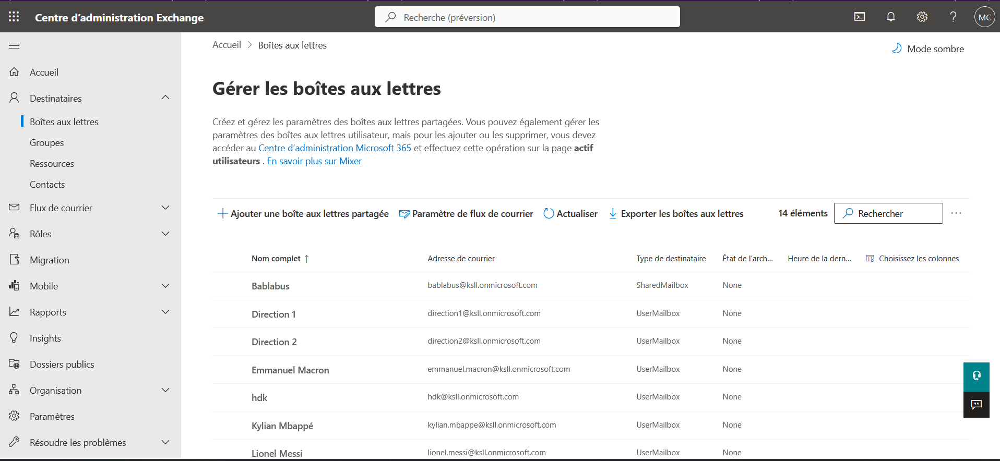
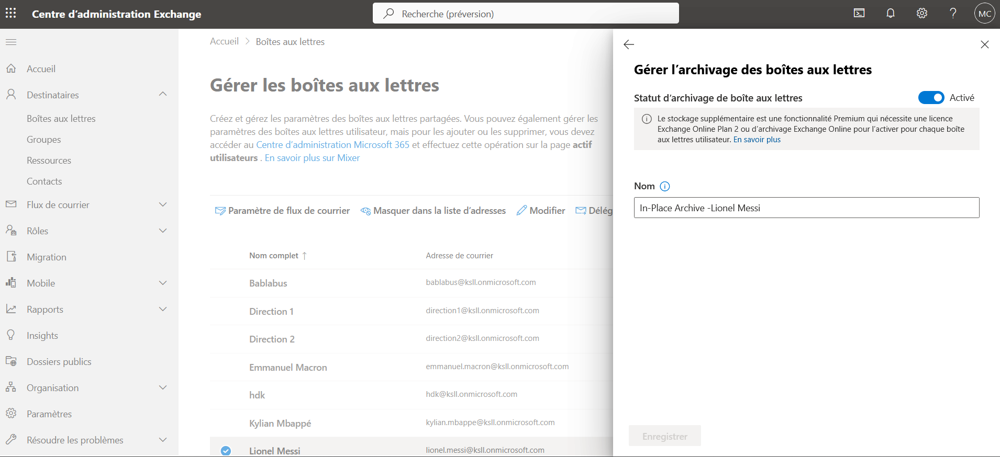
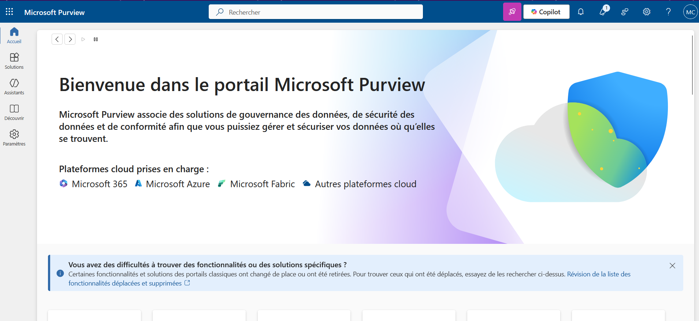
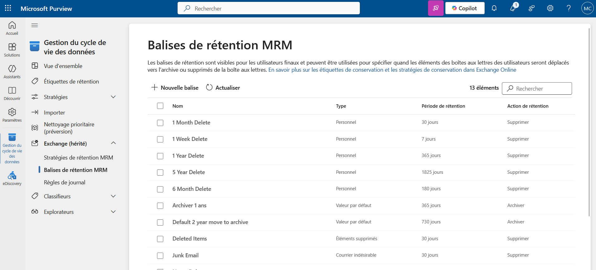
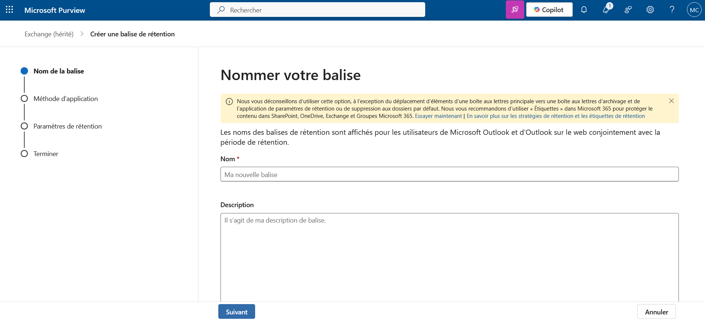
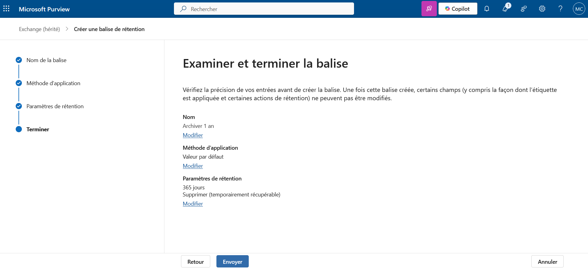
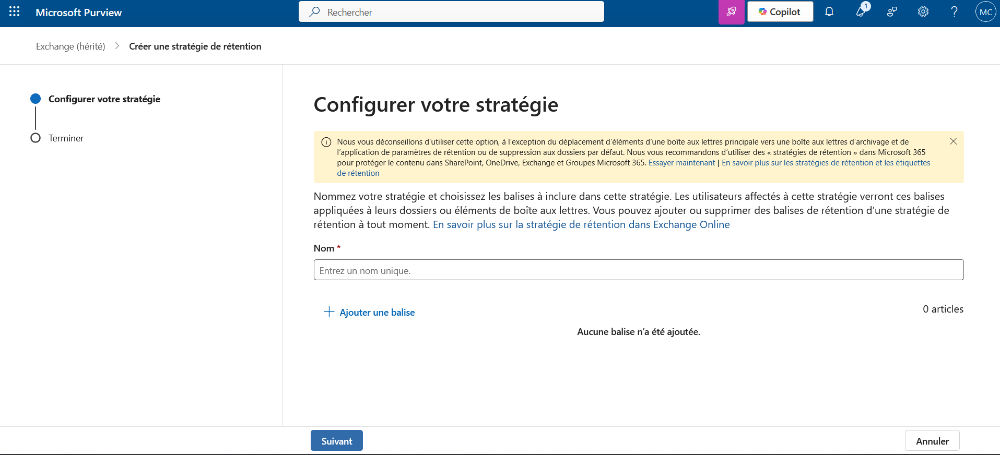
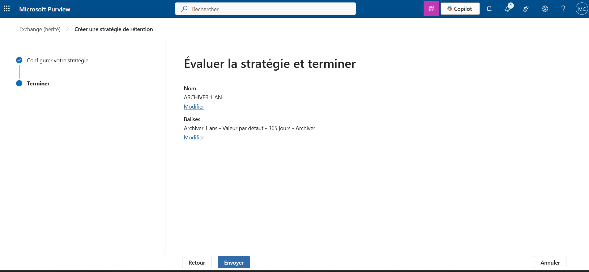
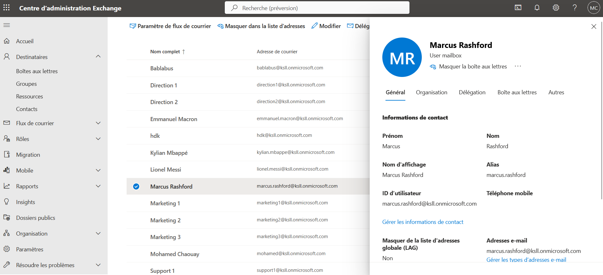
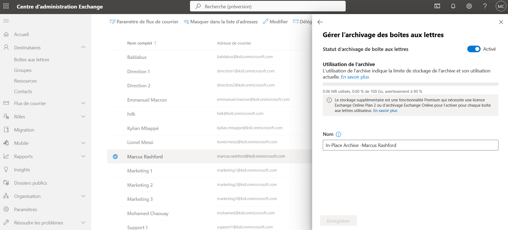

# Procédure d'archivage en ligne sur Microsoft 365

Cette procédure détaille les étapes pour configurer l'archivage automatique des emails sur Microsoft 365 à l'aide des centres d'administration Exchange et Purview.

## Prérequis

- Accès administrateur à Microsoft 365
- Licences appropriées pour l'archivage (Exchange Online Plan 2 ou licence d'archivage)

## Étapes de configuration

### 1. Activation de l'archivage dans le centre d'administration Exchange

1. Connectez-vous au **Centre d'administration Exchange**

   

2. Dans le menu de navigation, allez dans **Destinataires** > **Boîtes aux lettres**

   

3. Sélectionnez la boîte aux lettres concernée
4. Vérifiez que l'option **Archive en place** est activée

   

### 2. Configuration des balises de rétention dans Purview

1. Accédez au **Centre d'administration Purview**

   

2. Naviguez vers **Solution** > **Gestion du cycle de vie des données** > **Exchange (hérité)** > **Balises de rétention MRM**

   

#### Création d'une balise de rétention

1. Cliquez sur **Créer une balise**

   

2. Configurez la balise selon vos besoins :
   - **Nom** : par exemple "Archiver 1 an"
   - **Périmètre** : Sélectionnez "Automatiquement à l'intégralité de la boîte aux lettres (par défaut)"
   - **Période de rétention** : 365 jours (pour 1 an)
   - **Action de rétention** : Sélectionnez "Déplacer l'élément vers l'archive"

   

3. Cliquez sur **Créer**

#### Création d'une stratégie de rétention MRM

1. Créez une **stratégie de rétention MRM**

   

2. Donnez-lui un nom descriptif
3. Ajoutez la balise créée précédemment à cette stratégie

   

4. Sauvegardez la stratégie

### 3. Vérification de la configuration

1. Retournez dans le **Centre d'administration Exchange**
2. Sélectionnez les boîtes aux lettres des utilisateurs concernés

   

3. Vérifiez que l'archivage est bien configuré
4. Vous devriez voir l'utilisation de l'archive dans les statistiques

   

## Notes importantes

- La mise en œuvre de l'archivage peut prendre jusqu'à 24 heures
- Les utilisateurs verront apparaître un dossier "Archive" dans leur client de messagerie
- L'espace d'archivage est généralement de 100 Go par défaut (peut varier selon la licence)

## Dépannage

Si l'archivage ne fonctionne pas :
- Vérifiez les licences utilisateur
- Contrôlez que les stratégies sont bien appliquées aux boîtes aux lettres
- Attendez le délai de traitement (jusqu'à 24h)

## Structure des fichiers pour GitHub

```
votre-repo/
├── README.md
├── procedure-archivage-m365.md
└── images/
    ├── exchange-admin-center.png
    ├── destinataires-menu.png
    ├── archive-en-place.png
    ├── purview-admin-center.png
    ├── navigation-balises-mrm.png
    ├── creer-balise.png
    ├── config-balise-retention.png
    ├── creer-strategie-mrm.png
    ├── ajout-balise-strategie.png
    ├── selection-boites-lettres.png
    └── stats-utilisation-archive.png
```

**Auteur** : [Votre nom]  
**Date de création** : [Date]  
**Version** : 1.0
